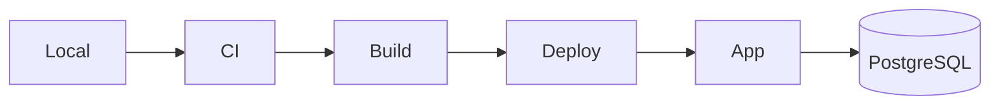

<!-- src/content/posts/markdown-cheatsheet-esa-infra.md -->
---
title: Markdownチートシート（LPIC / DB / インフラ文脈版・esa docsベース）
description: Markdownを忘れたときに最短で思い出すためのメモ。例文はLPIC学習者（Linux / DB / インフラ）向け。
pubDate: 2026-02-05
---

# Markdownチートシート（LPIC / DB / インフラ文脈版・esa docsベース）

このページは「Markdownを忘れたときに、最短で思い出す」ためのメモ。  
例文は LPIC 学習者（Linux / DB / インフラ）向けに寄せてある。

原典（出典・詳しい説明はこちら）:
- https://docs.esa.io/posts/49

注意:
- 原典は esa のエディタでの挙動（拡張記法）も含む。GitHub や静的サイト（Astro 等）では未対応のものがあるので、使う場所に合わせて取捨選択する。

---

## 見出し

`#` の数で階層を作る。

```md
# 1. 認証の基本
## 1.1 SSHの鍵
### 1.1.1 known_hosts
```

---

## 強調

太字は `**`。

```md
**重要**: 秘密鍵（private key）は絶対に貼らない
```

取り消し線は `~~`（環境によっては `~` も可）。

```md
~~rootで全部やる~~ まずは最小権限で試す
```

---

## リンク

`[表示](URL)`。

```md
[OpenSSH の設定](https://man.openbsd.org/sshd_config)
```

URL をそのまま置くと自動リンクになることがある（環境依存）。

```md
https://docs.esa.io/posts/49
```

---

## 箇条書き

`-` + 半角スペース。

```md
- ログ確認
  - /var/log/auth.log
  - journalctl -u ssh
- 設定確認
  - /etc/ssh/sshd_config
```

---

## 番号付きリスト

`1.` など。多くの環境で自動的に連番になる。

```md
1. 事象を再現する
1. ログを取る
1. 差分を切り分ける
```

---

## 引用

`>` で引用。

```md
> まず観測せよ。推測はその後だ。
```

---

## 罫線

`---` など。

```md
---
```

---

## コード

### インラインコード

```md
`systemctl status sshd`
```

### コードブロック

バッククォート3つ。

````md
```bash
# 直近のSSHログ（環境によりユニット名は ssh / sshd など）
journalctl -u sshd --since "1 hour ago" --no-pager
```
````

言語名を付けるとハイライトされることがある。

````md
```sql
SELECT now(), current_user;
```
````

---

## テーブル

テーブルの直前は空行が安全。

```md
| サービス | ポート | メモ |
| --- | ---: | --- |
| SSH | 22 | 可能なら鍵認証 |
| HTTP | 80 | リダイレクト用途 |
| HTTPS | 443 | 本番は基本これ |
| PostgreSQL | 5432 | 公開しないのが基本 |
```

セル内改行は `<br>`（環境依存）。

```md
| 種別 | 例 |
| --- | --- |
| ログ | /var/log/syslog<br>journalctl |
```

---

# 実務で効く拡張・表現（環境依存あり）

ここから先は「対応している場所だと強い」やつ。  
esa / GitHub / 一部のMarkdown実装で挙動が変わる。

---

## タスクリスト

```md
- [ ] firewallの現状確認（ufw / nftables）
- [ ] SSHの設定監査（PermitRootLogin / PasswordAuthentication）
- [x] バックアップ取得（作業前）
```

---

## 折りたたみ（HTML details）

長いログや手順をしまうのに便利。中にMarkdownを書くなら空行を挟む。

````html
<details><summary>journalctl の出力例</summary>

```bash
journalctl -u sshd -n 50 --no-pager
```

</details>
````

---

## アラート（Markdown Alert）

環境が対応している場合、注意喚起を読みやすくできる。

```md
> [!NOTE]
> 学習メモ: SSH は「鍵が本人確認、設定がルール、ログが証拠」だと思うと整理しやすい。

> [!WARNING]
> 秘密情報（APIキー、トークン、秘密鍵）は Markdown に貼らない。
```

---

## 脚注（footnote）

長文で「補足を後ろに逃がす」用途。

```md
本番DBは基本的に公開しない[^db]

[^db]: 例外は踏み台やVPN、Private Linkなどで閉域に閉じる設計。
```

---

## 数式（MathJax / TeX）

対応環境なら、性能や容量計算のメモが読みやすくなる。

````md
```math
RPS = \frac{requests}{second}
```
````

インライン（対応環境のみ）:

```md
接続数の上限は $max\_connections$ とワーカー数の関係で決まることが多い。
```

---

## Mermaid（図）

対応環境なら「構成図」「手順フロー」を文章より速く理解できる。

````md

````

---

## UML（PlantUML）

対応環境なら、シーケンス図で「認証フロー」などを固定化できる。

````md
```uml
Alice -> SSHD: connect (publickey)
SSHD --> Alice: challenge/ok
Alice -> SSHD: open session
SSHD --> Alice: shell
```
````

---

## uiflow（画面遷移の簡易図）

対応環境なら、手順書・運用フローが一気に読みやすくなる。

````md
```uiflow
[Login]
ログイン画面
---
鍵 or SSOで認証
==> Dashboard

[Dashboard]
監視と作業メニュー
==> Runbook
```
````

---

# セキュリティ寄りの書き方メモ

- 秘密情報は貼らない（鍵・トークン・Cookie・内部URL）。必要なら「伏字」か「ダミー値」にする。
- ログは「必要な範囲だけ」。個人情報やアクセス元IPが混じるならマスキングする。
- コマンドは「実行環境」を明記すると事故が減る（例: local / staging / prod、OS、ディストリ）。
- 手順は「観測→仮説→検証→結論」の順に書くと後から自分が助かる。

---

# 参照リンク

原典（esa docs）:
- https://docs.esa.io/posts/49

関連（仕様・実装差分の確認用）:
- https://github.github.com/gfm/
- https://github.github.com/gfm/#autolinks-extension-
- https://github.com/rouge-ruby/rouge
- https://plantuml.com/
- https://mermaidjs.github.io/
- https://github.com/andrewrjones/uiflow
